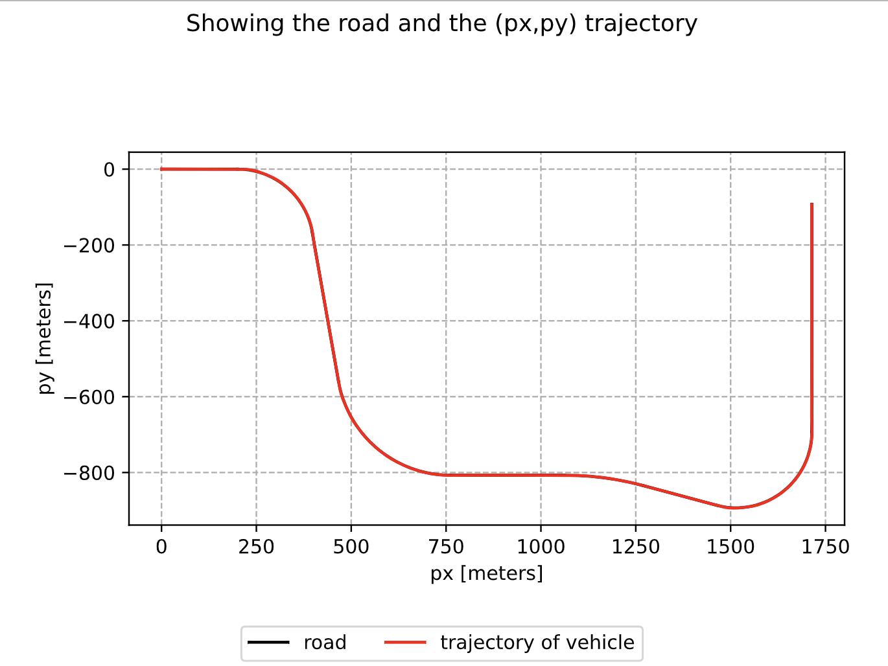
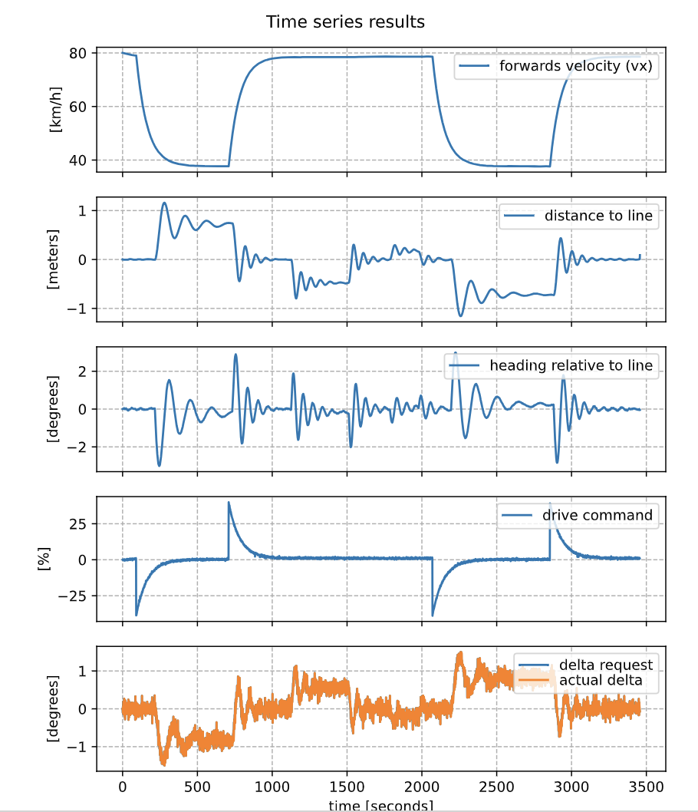

# Real-Time Iteration MPC for Autonomous Vehicle Control

This project implements a Real-Time Iteration (RTI) Model Predictive Control (MPC) algorithm to control an autonomous vehicle modeled using a kinematic bicycle model. The controller tracks reference trajectories while accounting for dynamic and actuation constraints, enabling stable control across different road difficulties and conditions.

## Full Report
Find detailed report [here](report.pdf).

---

## Problem Formulation

The objective is to minimize the deviation from a desired reference trajectory while penalizing control effort:

$$
\min_{\{s_k, a_k\}} \frac{1}{2} \sum_{k=0}^{N-1} \left( \|s_k - \bar{s}_k\|_Q^2 + \|a_k - \bar{a}_k\|_R^2 \right)
$$

subject to:

$$
s_{k+1} = f_d(s_k, a_k), \quad \forall k = 0, \ldots, N-1
$$

$$
l_a \leq a_k \leq u_a
$$

where:
- $s_k \in \mathbb{R}^4$ are the states
- $a_k \in \mathbb{R}^2$ are the control inputs
- $\bar{s}_k, \bar{a}_k$ are the reference states and actions
- $Q$ and $R$ are positive semi-definite weighting matrices
- $N$ is the time horizon
- $f_d$ is the system dynamics (described [here](#system-dynamics))

---

## RTI-MPC Approach

The nonlinear problem is linearized around a nominal trajectory and solved using a **single QP per control step**, allowing real-time feasibility.

Linearized dynamics:

$$
s_{k+1} \approx A_{d,k} s_k + B_{d,k} a_k + g_{d,k}
$$

Resulting in the condensed QP form:

$$
\min_x \frac{1}{2} x^T P x + q^T x
$$

$$
\text{subject to } l \leq A x \leq u
$$

where $x$ stacks all states and control variables over the horizon.

---

## System Dynamics

A **kinematic bicycle model** governs the system with states:
- $p$: progress along the road \([m]\)
- $d$: lateral deviation from the road centerline \([m]\)
- $\mu$: heading angle relative to path tangent \([rad]\)
- $v$: rear axle velocity \([m/s]\)

Continuous-time dynamics:

$$
\dot{p} = \frac{v \cos(\mu)}{1 + d \kappa(p)}
$$

$$
\dot{d} = v \sin(\mu)
$$

$$
\dot{\mu} = \frac{v \tan(\delta)}{l_r} - \frac{\kappa(p) v \cos(\mu)}{1 + d \kappa(p)}
$$

$$
\dot{v} = \frac{1}{m} (F_{cmd} C_m) - \frac{1}{m} (C_d v^2 \, \text{sign}(v))
$$

where:
- $\delta$ = steering angle [rad]
- $F_{cmd}$ = drive command (normalized [-100, 100]%)
- $\kappa(p)$ = road curvature
- $l_r$ = distance from rear axle to center of mass
- $C_m, C_d$ = motor and drag coefficients
- $m$ = mass

---

<!-- ## Repository Structure -->

<!-- - `rti-mpc.ipynb` — RTI-MPC simulation and control algorithm
- `evaluate-mpc-*.ipynb` — Controller evaluation on easy, medium, and hard tracks
- `mpc.py` — Core MPC class for system setup and QP solving
- `mpcFigures/` — Simulation figures
- `report.pdf` — Full project report detailing derivations and evaluations
- `trajectory_animation.gif` — Animation of the vehicle trajectory -->

## Results

